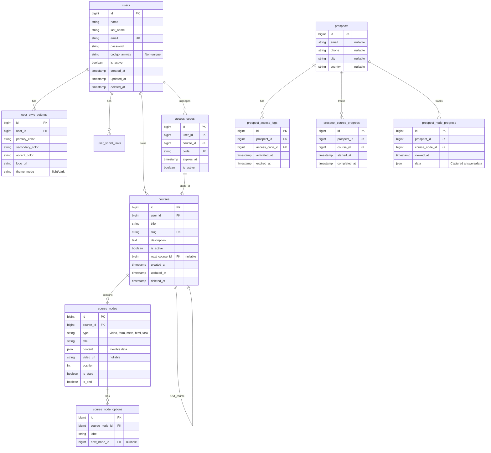

# Modelo de Datos (Definitivo)

## 1. Diagrama ER (Sugerido)

## 2. Definición de Tablas y Campos

### 2.1 Users & Config
*   **users**: Tabla principal para empresarios. Soporta `soft_deletes`.
*   **user_style_settings**: Personalización visual por usuario.
*   **user_social_links**: Redes sociales y contacto del empresario.

### 2.2 Cursos y Nodos
*   **courses**: Secuencias educativas. `next_course_id` permite encadenamiento.
*   **course_nodes**: Pasos del curso. `type` define el comportamiento (video, form, etc). `is_start` e `is_end` marcan los límites.
*   **course_node_options**: Define la navegación entre nodos (ramificaciones).

### 2.3 Accesos y Prospectos
*   **access_codes**: Códigos generados por usuarios para dar entrada a cursos.
*   **prospects**: Usuarios finales (sin auth tradicional). Datos mínimos iniciales.

### 2.4 Progreso y Logs
*   **prospect_access_logs**: Historial de activaciones de códigos.
*   **prospect_course_progress**: Seguimiento de cursos iniciados/completados.
*   **prospect_node_progress**: Registro granular de nodos vistos y datos capturados (en campo `data`).

## 3. Notas de Implementación
*   **Soft Deletes**: Implementar en todas las tablas principales (`users`, `courses`, `nodes`).
*   **JSON Content**: Usar campo `content` en `course_nodes` para flexibilidad de tipos de nodo.
*   **Navegación**: La lógica de "siguiente nodo" reside en `course_node_options`. Si un nodo no tiene opciones, es un nodo terminal o lineal simple.
